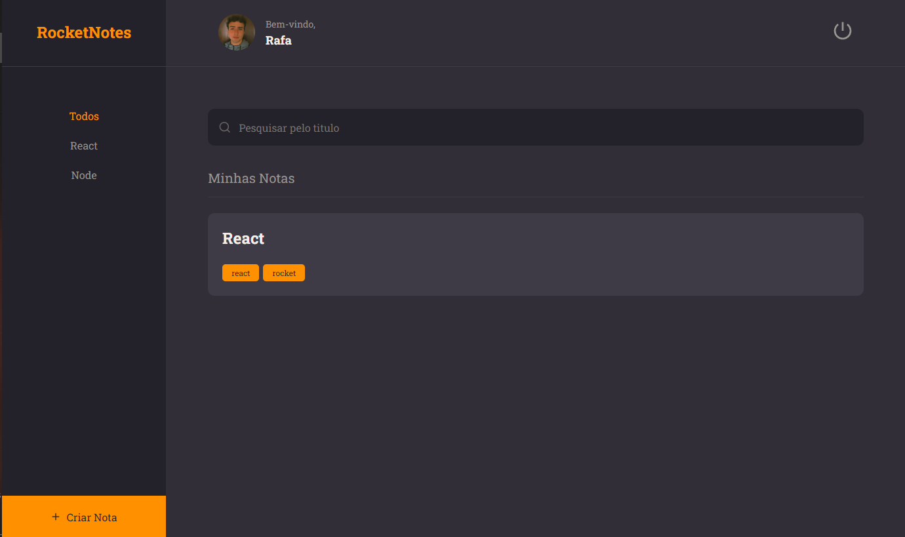

# Front-end w/ React
 

> Stage 09 Explorer

Front-end para o projeto RocketNotes com rotas básicas utilizando React e suas tecnologias, além de utilizar o styled components (CSS in JS) para deixar o projeto mais performático e automaziado. Este projeto foi feito através do curso Explorer da Rocketseat (Stage 09).

## 🚀 Tecnologias

- Javascript
- ESLint
- React
- React-icons
- React-dom
- React-router-dom
- Styled Components
- Vite
- CSS
- HTML
- Git e Github

## 📞 Contato

>rafael.loren175@gmail.com

>+55 (11) 99959-9140

## 👾 Discord

>rafas#7622